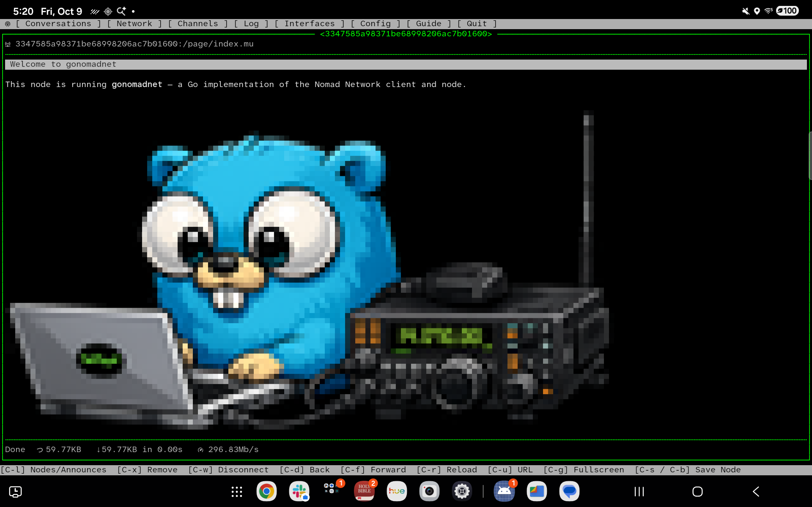
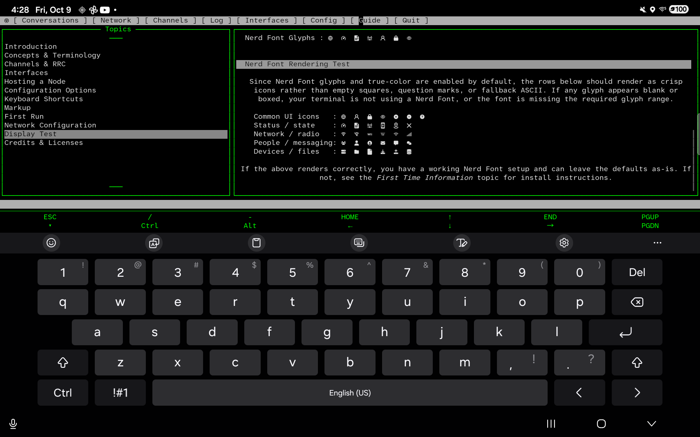

# gonomadnet node — the Android app

**gonomadnet node** turns an Android tablet into a self-contained Reticulum node.
The app runs the Reticulum transport, an RRC hub and a chat bot under its own
uid, publishes the tablet's GNSS fix and compass heading as a sensor feed, and
runs the `gonomadnet` client itself, on a console of its own inside the app.

You get everything from one install — **one APK, one location grant, and no
second app of any kind**:

- a **node** that runs on the tablet with no computer and no server,
- **real sensors**, so position commands answer with where the tablet actually is, and
- **the client**, which the app starts out of its own storage and draws on its own screen.

Nothing about your position leaves the device unless you ask for it — see
[Privacy](#privacy).

If you want the client inside Termux instead, on a device without this app, see
[`docs/Android.md`](Android.md). It is a complete guide and needs nothing here.

---

## Getting started

Everything on this page happens **on the device**. No computer, and no Android
development tools, are needed — though `adb` is mentioned as an alternative for
anyone who has them.

### 1. Install the app

Download `gonomadnet-<version>-android-arm64-v8a.apk` from the
[latest release](https://github.com/gmlewis/go-nomadnet/releases) and open it from
your notifications or your Downloads. Android will refuse the first time and offer
a settings link — allow installing from the app you opened it with (**Chrome**,
**Files**, or your browser), then tap **Install** again. The app appears as
**gonomadnet node**.

That is the only thing you install. The app carries its own client and the
console that gives it a terminal, so there is nothing to download per device and
nothing to copy anywhere.

With a computer: `adb install -r gonomadnet-<version>-android-arm64-v8a.apk`.

### 2. Grant location

Open **gonomadnet node** and accept the location permission it asks for. It uses
the permission only to read the device's own GNSS receiver — see
[Privacy](#privacy).

Without it the sensors do not run, and the app says so on its screen. Everything
else works; position commands simply have no fix to answer with.

### 3. Start the node

Tap **Start stack**. Three daemons start — `gornsd` (transport), `gorrcd` (hub)
and `gorrcbot` (bot) — plus three `gonsensor` converters, and the screen reports
the node's address when they are up.

Failures appear on this screen as well: the daemons have nowhere else to report
them.

**Start sensors** and **Stop sensors** control the sensor service on its own. It
runs with the stack or without it; running it alone costs the least battery.

### 4. Open the client

Tap **Open gonomadnet**. The app starts its transport if it is not already up,
waits for it, and then runs its own client on a pseudo-terminal it creates — see
[The console](#the-console).

### 5. Ask the bot where you are

In the client, Tab to **Channels** in the menu bar and press Enter, connect to
the hub and join a room (`Ctrl-a` adds one), then send `/msg gobot whereami` from
the room's editor with `Ctrl-d`. The reply tells you where the device actually
is, from its own receiver.

### What the app does, and what you still do

| Step | Who |
| --- | --- |
| Get the client for this device | **the app** — it is inside the APK |
| Give the client a terminal | **the app** — its own console, on a pseudo-terminal |
| Attach the client to a transport | **the app** — one it owns and starts first |
| Start the node, start the sensors | you, by button |
| Grant location | you, once (one prompt) |
| Open the client | you, by button |

## The controls

Every control on the app's screen, in the order it appears.

| Control | What it does |
| --- | --- |
| **Open gonomadnet** | Starts the transport if needed, waits for it, and opens the client on the console. |
| **Start sensors** / **Stop sensors** | The sensor service on its own. It holds a partial wake lock while it runs — see [Sample rate and battery](#sample-rate-and-battery). |
| **Start stack** / **Stop stack** | The transport, the hub and the bot. The sensors start with the location permission, independently of these. |
| **Heading axis** | Which axis the heading is measured from. A mounting choice, not a preference — see [Heading](#heading-the-screen-back-normal). |
| **hub host:port** and **Save hub address** | The one interface the appliance's transport dials. Saving it resolves the name and reports what it resolved to. |

The readout at the top names which of the four running/stopped combinations the
tablet is in.

## What the client comes with

The client is configured before it has ever run, because a freshly installed
appliance has to work without anybody configuring anything.

**The interface it connects through.** The transport dials the hub address the
controls screen holds — `go-nomadnet.duckdns.org:4242` unless it was changed —
and the client's own Reticulum configuration lists that same interface. The
client owns none of it (the shared instance does), but the client's Interfaces
page is a view of that file, so the page shows the interface the appliance is
actually talking through, with its live traffic rather than a blank list.

The client asks the transport for those live numbers over the transport's own RPC,
and both sides are given the key for it (`[reticulum] rpc_key`) rather than each
deriving one of its own. The key is minted once per install and persists, so the
page reports the interface the appliance is really using — connected, with its
traffic — instead of an interface it cannot see.

**Three channels.** The client's channel store is written once, the first time
the console is opened, and only when the client has never run:

| Channel | What it is |
| --- | --- |
| `RNS Community` | the community hub, which carries the wider RRC network |
| `gonomadnet Public Hub` | this project's public hub |
| `appliance-hub` | the hub inside the appliance, where its own bot answers `/msg gobot` |

The local hub's destination is derived from an identity generated on the device,
so it is listed once that hub has published it: an appliance whose stack has
never been started has no local hub to list, and it appears the next time the
console is opened. Once the client has run, the store is the client's own file —
a channel added or removed in the interface stays that way.

## The console

**Open gonomadnet** runs the client *inside the app*: nothing is copied into
anybody's home, and there is no terminal to find. The app binds an abstract Unix
socket, starts `libgorcons.so`, which opens a pty and runs the APK's own client on
it, and draws what comes back. The console is the whole screen: there is no title
bar over it and no band under it, because those are rows the client's interface
does not get.

The keys a tablet has no way to press are a two-row strip along the bottom edge,
the same one Termux's extra-keys row carries:

| | | | | | | |
| --- | --- | --- | --- | --- | --- | --- |
| `ESC` | `/` | `-` | `HOME` | `↑` | `END` | `PGUP` |
| `▾` | `Ctrl` | `Alt` | `←` | `↓` | `→` | `PGDN` |

**Ctrl** and **Alt** are latches rather than keys: tap one, then type the letter it
applies to, and it is sent as that combination. The **▾** button folds the strip
away, which hands its two rows back to the client; the **▴** it leaves behind brings
it back.

The strip is drawn **only while the on-screen keyboard is up**, and it sits
directly above it, exactly as Termux's row does. With the keyboard down there is
no strip and no green divider over the taskbar: the client gets every row of the
screen. The client is resized around the strip, so its interface reflows rather
than being covered.

**A finger scrolls.** Dragging up or down over any pane — a Guide topic, a page in
the browser, a room's messages — scrolls what is under the finger, and it tracks
the finger rather than running ahead of it. When the client is not using the mouse
at all, the same drag scrolls the console's own scrollback instead.

On the console the client draws what it always draws, in the APK's own font and
colors. Its starter page is the **gonomadnet mascot**, drawn from the `index.mu`
the client seeds into its pages directory, in half-block characters and true color:



The Nerd Font icons in the menu bar and the panes are the font travelling in the
APK, with the key strip above the on-screen keyboard:



## The terminal font

The client draws its icons from the Nerd Font private-use area by default —
`glyphs = nerdfont` is the shipped setting — and a terminal without such glyphs
renders the menu bar and the Users pane as empty boxes. The APK carries
**Atkynson Mono Nerd Font Mono** and the console draws with it, so inside the app
there is nothing to install.

The font travels with its own license file (SIL Open Font License 1.1), which is
the other reason it is in the APK.

A **Termux** user gets the same font the same way they get everything else: put
the file in `/sdcard/Download` and the client installs it to `~/.termux/font.ttf`
on its first run. See
[`docs/Android.md`](Android.md#7-clipboard-and-other-polish).

## The terminal colors

The client draws most of its chrome — the frame borders, the pane titles, the key
hints along the bottom — in the terminal's **default** foreground and background,
and its accents from the terminal's own **16-color palette**. Those are resolved
by whichever terminal is drawing, not by the client, so the same client under a
stock white-on-black palette and under a themed one renders the same interface in
visibly different colors. Everything the client names explicitly (message text,
nick colors, the editor bar) is identical either way.

The console inside the app resolves those defaults itself, **from the same file**:
`assets/colors.properties`, which the APK carries, is the appliance's terminal
theme — a black background, a bright green foreground, and the sixteen gruvbox
colors.

Under Termux, the client installs that same file into
`~/.termux/colors.properties` the first time it runs, and asks Termux to re-read
its settings. It never replaces a file that is already there.

To see what a terminal is resolving those defaults to, ask it:

```sh
printf '\e[39mdefault foreground\e[49m\n'   # your terminal's default fg/bg
```

To go back to Termux's own colors, delete `~/.termux/colors.properties` and run
`termux-reload-settings`.

## The tmux configuration (for debugging)

**You do not need tmux to run gonomadnet on Android, and neither the app nor the
client ever starts it.** The client is meant to run directly in Termux or in the
app's console: on a tablet with a virtual keyboard open, tmux's status bar and its
window list cost lines that the interface wants for messages.

The APK nevertheless carries **`tmux.conf`** for the person who chooses to debug
under tmux. **You do not install this one by hand**: the client does it the first
time it runs inside Termux, copying the published file to `~/.tmux.conf`. It
installs it only when nothing is there already, so a configuration you have edited
stays yours.

tmux is not part of the app. It is a Termux package you install yourself, once,
if you want it:

```sh
pkg install tmux
```

It puts the status bar on top with blue accents, numbers windows and panes from
one, and — the part worth having — **passes 24-bit color through instead of
reducing it to 256**. Drop the color settings and the whole interface shifts to
the nearest 256-color approximation. To check a running pane, run this inside it:

```sh
echo "$TERM"        # tmux-256color
echo "$COLORTERM"   # truecolor
```

## The sensors

### Heading: the screen-back normal

The heading is the direction the **back of the device** points — the way the
operator faces when they are looking at a screen on a stand. The alternative is
the **top edge of the screen**, which is right for a device lying flat and face
up. The two agree only when the device is flat, so choose the one that matches
how you mount it:

| Mounting | Reference |
| --- | --- |
| Upright on a stand, operator facing the screen | **screen-back** (default) |
| Lying flat, face up | screen-top |

Rotating the screen is corrected for separately: turning the device on its stand
does not turn your heading with it.

When the chosen reference cannot be trusted, the app reports **no heading**
rather than a wrong one, and leaves the field out of the sample entirely. That
happens when the device lies flat while the screen-back axis is selected, and
when it stands up in portrait while the screen-top axis is selected. If a command
tells you the heading is unavailable, stand the device up to use the screen-back
axis — or pick the other axis on the app's screen — and ask again.

### Compass

The heading comes from the device's fused orientation sensor, not from its raw
magnetic field. A raw field reading on a device like this one is dominated by the
case, the stand and the driver, and carries no indication of how good it is.

### GNSS

The receiver works, but **a cold start with no sky view does not converge**, and
there is no timeout that turns an absence of satellites into a position. Indoors
the app sits in an "acquiring satellites" state — that is the normal waiting
state, not an error. Expect tens of seconds to the first fix with a clear view.

The heading never comes from GNSS: on a device that is standing still, a
satellite-derived course is tens of degrees off. It is used only as a cross-check
on the compass.

### Sample rate and battery

Sensors are registered at 50 Hz. All of them are **non-wakeup**, so their
readings stop when no wake lock is held.

The sensor service holds a partial wake lock for as long as it runs, and releases
it when you tap **Stop sensors**. That is what keeps the readings flowing with the
screen off, and it is also the app's main battery cost: run the sensors only while
you want a live position, and the client and node work without them.

## The sensor feed

The sensor service publishes position and heading as a feed the bot and the
client both read. Two things about it fail quietly, so they are worth knowing.

**The service holds the feed open at both ends**, so a reader never waits for a
writer that is not there. A reader that opened the pipe read-only instead would
**block forever** when nothing holds the write end, with no error and no timeout.

| The service is | A reader that opens the feed | A reader already attached |
| --- | --- | --- |
| running | opens at once | reads samples as they arrive |
| stopped | **blocks forever, silently** | sees end of file and stops |

**Restarting the bot is safe.** Kill `gorrcbot` and start it again while the
service is running; it re-reads the feed immediately.

**Start the service before the bot.** With the service stopped, a newly started
bot parks in the open with no log line to say so. The app's **Start stack**
button does this in the right order.

## The ports

| Port | Used by |
| --- | --- |
| `127.0.0.1:37428` | Reticulum shared instance (the app owns it) |
| `127.0.0.1:37429` | Reticulum's own control port — reserved, do not use |
| `127.0.0.1:37430` | the sensor feed |

All three are **loopback only**: they are reachable from this device and from
nowhere else. The shared instance is a TCP socket rather than an abstract Unix
socket, because two Android applications cannot be assumed to reach each other's
abstract sockets.

The client the app runs attaches to that shared instance and requires it —
`require_shared_instance = yes` — so it can never win a race for ownership and
quietly become a transport of its own. Its Nomad Network configuration is its
own, under the app's private storage: the messages, the peers and the identity
live there, and a second client announcing the same identity is a node that
appears twice.

## The bot

The bot answers a private request only when the hub can deliver the reply. Two
conditions must hold, and the app sets both for the hub it starts:

| Requirement | Why | How it is set |
| --- | --- | --- |
| The bot and its hub are attached to the **same Reticulum instance** | A bot on one instance cannot hear a hub on another | Pass the hub `--configdir`, and make sure the config file does not blank it out |
| The hub **names the joiner** in the member notification it fans out | A bot already in a room otherwise never learns a peer that joins later, and drops that peer's requests | Run the hub with `--include-joined-member-list` |

If you run your own hub and the bot answers nothing, check those two first.

Every position command is answered from the tablet's own receiver:

| Ask | Uses the live fix? |
| --- | --- |
| `whereami` | yes |
| `loc C984+5V` | yes — a shortened Plus Code is completed against the live fix |
| `sun` | yes |
| `dist <a> to <b>`, `proj <point> <course> <distance>` | no — the points are named explicitly |
| `moon` | no — an almanac is the same for everybody |

`loc` with no argument prints its usage line (`loc <pluscode|coords|grid>`) rather
than an answer.

## Privacy

The app knows where the tablet is, because that is the point: it publishes the
position and heading so position commands can answer with them. What matters is
what happens next.

**Nothing about your position is sent unless you ask for it.**

- **Announces carry no coordinates.** The app announces the node and its
  messaging address, as any Reticulum node does.
- **Commands answer only the person who asked.** `/msg gobot whereami` replies
  with direct notices to that one client; nothing is posted into a room.
- **The client never shows your position to anyone else.** A `L` location
  construct in a page is resolved for *the reader*; your own coordinate is never
  rendered into a page, a status line, or a message.
- **Nothing is stored in a form that can leak later.** With a live fix in hand,
  no notation of that position — decimal, DMS, Plus Code, Maidenhead grid, or the
  raw bits — appears in the node's state on disk.

These are not just rules the code follows: the parts of the client that announce,
fetch pages, send messages and write state are given no access to the position at
all. The client's interface is the only thing that holds it, and the only thing
that renders it.

**You can always see what the app knows.** The client logs the reader's position
whenever it changes:

```
reader position: no fix from the sensor feed tcp://127.0.0.1:37430
reader position: a live fix, just now, +-3.8 m
```

A static coordinate pasted into a config file is not part of this design: the
live feed always takes precedence over a configured `fix`.

## Debugging

Start with the logs.

The commands below need a computer with `adb`, and the ones that use `run-as`
need a **debug build** of the app (`./scripts/build-android-apk.sh --debug`): a
release APK is not debuggable, and Android refuses `run-as` on it.

```sh
PKG=com.gmlewis.gonomadnet

# The daemons' logs and the sensor service's
adb shell run-as $PKG ls files/logs
adb shell run-as $PKG cat files/logs/gorrcd.log
adb shell run-as $PKG cat files/logs/gorrcbot.log

# The app's own log, for permission and start-up problems
adb logcat -s gonomadnet

# The sensor service's log, which is a tag of its own
adb logcat -s gonomadnet-sensors

# Is the app running, and as which uid?
adb shell ps -A -o PID,USER,NAME | grep -E 'gonomadnet|gornsd|gorrcd|gorrcbot'
```

Then check what is supposed to be listening, because a service can be running
while its port is not bound:

```sh
# The shared instance and the sensor feed (37428 and 37430 in hex)
adb shell 'cat /proc/net/tcp' | grep -iE '9234|9236'
adb shell 'cat /proc/net/unix' | grep -i reticulu

# From inside the app, where /proc is unreadable: bash's /dev/tcp
adb shell run-as $PKG sh -c 'exec 3<>/dev/tcp/127.0.0.1/37428 && echo shared instance up'
```

For the sensors themselves:

```sh
adb shell dumpsys sensorservice | head -40
adb shell dumpsys location | head -40   # whether a provider has ever produced a fix
```

## Troubleshooting

| What you see | What it means | What to do |
| --- | --- | --- |
| The client says it cannot attach; `37428` refuses | The transport is not running | Tap **Start stack** and wait for the app to report the node address; **Open gonomadnet** does this itself |
| **Open gonomadnet** opens a console that says the client exited at once | The shared instance was not up when the client looked for it | Tap **Open gonomadnet** again, or **Start stack** first and wait for the address |
| The app says location permission is refused | Android never granted it | Grant it in Settings → Apps → gonomadnet node → Permissions; the sensors cannot run without it |
| `SIGSYS: bad system call` in a daemon's log | A daemon resolved a bare program name; Android kills the process for it | Every subprocess must be launched by an absolute path |
| `route ip+net: netlinkrib: permission denied` | `AutoInterface` is blocked on Android | Use a `TCPClientInterface` instead; see [`docs/Android.md`](Android.md) |
| `Failed to initialize TCP server interface …: listen tcp: address [[::]]:4242: missing port in address` | `listen_ip = [::]` was bracketed a second time | Write `listen_ip = ::` without brackets |
| `dial tcp: lookup "2603:…": no such host` | A value in the Reticulum config is quoted; its INI parser keeps the quotes as part of the value | Write every config value bare, as the shipped configuration does |
| `Could not initialize Reticulum: … 127.0.0.1:37429: bind: address already in use` | Something else took Reticulum's own control port | Do not publish anything on 37429; the sensor feed uses 37430 |
| The bot never connects; `hub "…": cannot connect: Hub identity unknown` | The hub is attached to a **different** Reticulum instance than the bot | Start the hub with the same configuration directory the clients use |
| The bot connects, requests arrive, and **nothing** is answered | The hub is not naming the joiner, so the bot never learns the asker | Run the hub with `--include-joined-member-list` |
| A restarted bot never starts, and logs nothing | The sensor service is not running, so opening the feed blocks forever | Start the service first; the app's **Start stack** does this in order |

### Daemon command-line conventions

These differ per program, and passing the wrong kind of path is the usual cause of
a daemon that will not start:

| Program | Option | Takes |
| --- | --- | --- |
| `gornsd` | `--config` | the Reticulum configuration **directory** |
| `gorrcbot` | `--config` | the Reticulum configuration **directory** |
| `gorrcbot` | `--bot-config` | the bot's own TOML **file** |
| `gorrcbot` | `--home` | the bot's home directory |
| `gorrcd` | `--config` | the hub's TOML **file** |
| `gorrcd` | `--configdir` | the Reticulum configuration **directory** |

**`gorrcd` and `gorrcbot` bootstrap and exit 0 on their first run**, writing their
default configuration. Starting them as daemons the first time leaves a
supervisor believing it has a running service when what it has is a file and a
dead process. Run each to completion once before starting it for real; the
appliance's supervisor does.

## Building it yourself

You do not need to build anything to use the app: the signed APK is attached to
the [latest release](https://github.com/gmlewis/go-nomadnet/releases). To build
one from source, sign it, or publish it with a release, see
[Android-Build.md](Android-Build.md).
